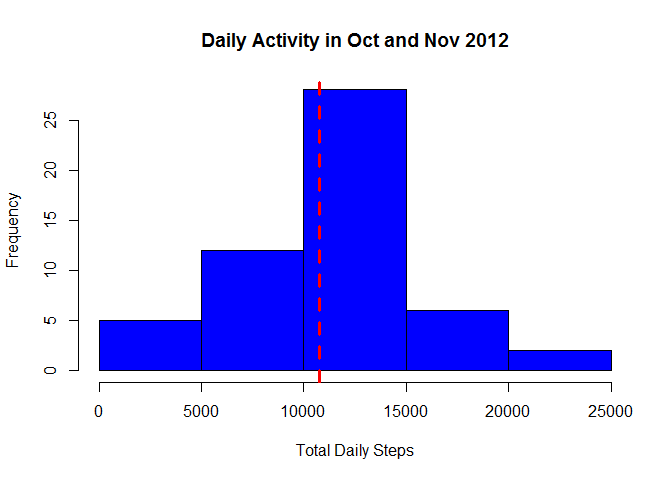
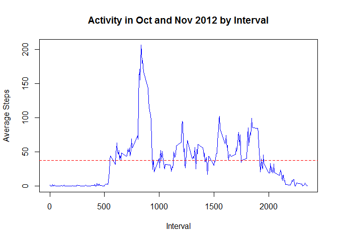
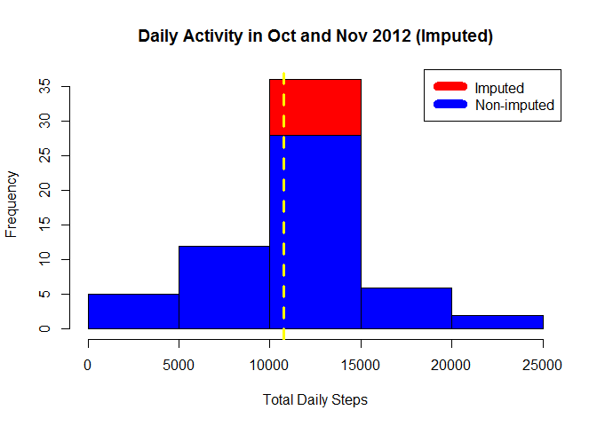
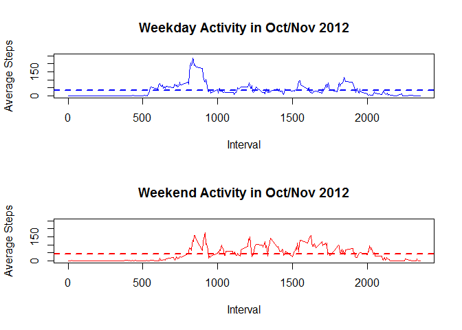

# Reproducible Research: Peer Assessment 1


## Loading and preprocessing the data

```r
if ("activity.zip" %in% dir()) unzip("activity.zip")

activity <- read.csv("activity.csv", na.strings = "NA",
                        colClasses=c("numeric","Date","numeric"))
```

## What is mean total number of steps taken per day?

```r
# Calculate the total number of steps taken per day
dailySteps <- tapply(activity$steps, activity$date, sum)

# histogram of the total number of steps taken each day 
hist(dailySteps
     ,col="blue"
     ,xlab="Total Daily Steps"
     ,main="Daily Activity in Oct and Nov 2012")
# add mean as dotted line
abline(v=mean(dailySteps,na.rm=TRUE),col="red",lty="dashed",lwd=3)
```

<!-- -->

```r
paste("Mean of total number of steps taken each day:"
      ,mean(dailySteps,na.rm=TRUE))
```

```
## [1] "Mean of total number of steps taken each day: 10766.1886792453"
```

```r
paste("Median of total number of steps taken eachday: "
      ,median(dailySteps,na.rm=TRUE))
```

```
## [1] "Median of total number of steps taken eachday:  10765"
```

## What is the average daily activity pattern?

```r
# Calculate the average number of steps taken per interval across days
intervalSteps <- tapply(activity$steps, activity$interval, mean, na.rm=TRUE)

# Make a time series plot of the 5-minute interval (x-axis) 
# and average number of steps taken, averaged across all days (y-axis)
plot(names(intervalSteps)
     ,intervalSteps
     ,type="l"
     ,col="blue"
     ,xlab="Interval"
     ,ylab="Average Steps"
     ,main="Activity in Oct and Nov 2012 by Interval")
# add mean as dotted line
abline(h=mean(intervalSteps,na.rm=TRUE),col="red",lty="dashed")
```

<!-- -->

```r
# Which 5-minute interval, on average across all the days in the dataset
# contains the maximum number of steps?
paste("Maximum number of average steps taken in an interval: "
      ,max(intervalSteps))
```

```
## [1] "Maximum number of average steps taken in an interval:  206.169811320755"
```

```r
paste("Interval with Maximum number of average steps: "
      ,names(intervalSteps[intervalSteps == max(intervalSteps)]))
```

```
## [1] "Interval with Maximum number of average steps:  835"
```


## Imputing missing values
###Strategy: Fill in the missing values in the dataset with the mean for that 5-minute interval

```r
#Calculate and report the total number of missing values in the dataset 
paste("Total number of rows with NAs: "
      ,sum(is.na(activity$steps)))
```

```
## [1] "Total number of rows with NAs:  2304"
```

```r
#Separate NA and not NA rows
activityNA <- activity[is.na(activity$steps),]
activityNoNA <- activity[!is.na(activity$steps),]

#Fill in missing values with mean for that interval
for (rowNum in 1:nrow(activityNA)) {
  activityNA[rowNum,]$steps <- 
    intervalSteps[names(intervalSteps) == activityNA[rowNum,]$interval]
}

#merge data frames
activityNoNA <- rbind(activityNoNA, activityNA)

# Calculate the total number of steps taken per day
dailyStepsNoNA <- tapply(activityNoNA$steps, activityNoNA$date, sum)

# histogram of the total number of steps taken each day 
hist(dailyStepsNoNA
     ,col="red"
     ,xlab="Total Daily Steps"
     ,main="Daily Activity in Oct and Nov 2012 (Imputed)")

hist(dailySteps
     ,col="blue"
     ,add=T);

legend("topright", c("Imputed", "Non-imputed")
       ,col=c("red", "blue"),lwd = 10)

# add mean as dotted line
abline(v=mean(dailyStepsNoNA),col="yellow",lty="dashed",lwd=3)
```

<!-- -->

```r
paste("Mean of total number of daily steps without Impute: "
      ,mean(dailySteps,na.rm=TRUE))
```

```
## [1] "Mean of total number of daily steps without Impute:  10766.1886792453"
```

```r
paste("Mean of total number of daily steps  with  Impute : "
      ,mean(dailyStepsNoNA))
```

```
## [1] "Mean of total number of daily steps  with  Impute :  10766.1886792453"
```

```r
paste("Median of total number of daily steps without Impute: "
      ,median(dailySteps,na.rm=TRUE))
```

```
## [1] "Median of total number of daily steps without Impute:  10765"
```

```r
paste("Median of total number of daily steps  with  Impute : "
      ,median(dailyStepsNoNA,na.rm=TRUE))
```

```
## [1] "Median of total number of daily steps  with  Impute :  10766.1886792453"
```

## Are there differences in activity patterns between weekdays and weekends?

```r
# day of week as Sunday(0) or Saturday(6)
activityWeekend <- activity[as.POSIXlt(activity$date)$wday == 0 | as.POSIXlt(activity$date)$wday == 6,]

# day of week as Monday(1) to Friday(5)
activityWeekday <- activity[as.POSIXlt(activity$date)$wday > 0 & as.POSIXlt(activity$date)$wday < 6,]

# Calculate the average number of steps taken per interval across weekends
intervalStepsWeekend <- tapply(activityWeekend$steps
                               ,activityWeekend$interval, mean, na.rm=TRUE)

# Calculate the average number of steps taken per interval across weekdays
intervalStepsWeekday <- tapply(activityWeekday$steps
                               ,activityWeekday$interval, mean, na.rm=TRUE)

# Make 2 time series plots of interval and average number of steps
# for weekday and weekend along with line for mean
par(mfrow = c(2, 1))

# Weekday plot
plot(names(intervalStepsWeekday)
     ,intervalStepsWeekday
     ,type="l"
     ,col="blue"
     ,xlab="Interval"
     ,ylab="Average Steps"
     ,ylim=c(0,250)
     ,main="Weekday Activity in Oct/Nov 2012")
abline(h=mean(intervalStepsWeekday,na.rm=TRUE),col="blue",lty="dashed",lwd=2)

# Weekend plot
plot(names(intervalStepsWeekend)
     ,intervalStepsWeekend
     ,type="l"
     ,col="red"
     ,xlab="Interval"
     ,ylab="Average Steps"
     ,ylim=c(0,250)
     ,main="Weekend Activity in Oct/Nov 2012")
abline(h=mean(intervalStepsWeekend,na.rm=TRUE),col="red",lty="dashed",lwd=2)
```

<!-- -->
